<!-- _class: title -->

# CSSE

## Your software engineering partner for reducing research risk through proportionate judgment

**Example engagement: iNaturalist x INQUIRE**

<!-- Thread statement: Frame CSSE as the engineering partner that makes research-software risk visible and manageable. -->

---

<!-- _class: risk -->

<b>◇</b>Hazard<b>!</b>Harm<b>◆</b>Control<b>✓</b>Evidence

## Research Harm Due to Software Is Real

<!--
- Use two or three examples suited to the audience; do not narrate every card.
- Distinguish observed harm from measured exposure. The AI package study demonstrates a repeatable exposure mechanism, not a catalog of downstream scientific incidents.
- Invalid fMRI inferences: common methods produced false-positive rates up to 70%; testing also uncovered a 15-year-old bug. PNAS, 2016: https://doi.org/10.1073/pnas.1602413113
- Genomic data silently altered: approximately 30% of examined papers with supplementary gene lists contained gene-name errors. PLOS, 2021: https://doi.org/10.1371/journal.pcbi.1008984
- Shared code would not run: 74% of more than 9,000 shared R files failed initial execution in a clean environment. Scientific Data, 2022: https://doi.org/10.1038/s41597-022-01143-6
- Invalid tests reached patients: invalid omics-based predictors were used in three Duke cancer clinical trials. IOM, 2012: https://www.ncbi.nlm.nih.gov/books/NBK202172/
- Researchers lost access: a ransomware attack removed access to most British Library online systems. British Library, 2024: https://www.bl.uk/stories/blogs/posts/learning-lessons-from-the-cyber-attack
- AI invented dependencies: code LLMs generated 205,474 unique nonexistent package names. Spracklen et al., 2024: https://arxiv.org/abs/2406.10279
-->

Research harm due to software is real—and documented in the public record.

  

    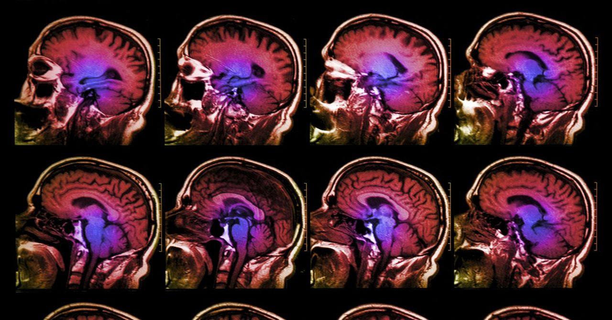
    
<small>WIRED · 2016</small><strong>Bug in fMRI software calls 15 years of research into question</strong>False-positive rates reached 70%.

  

  

    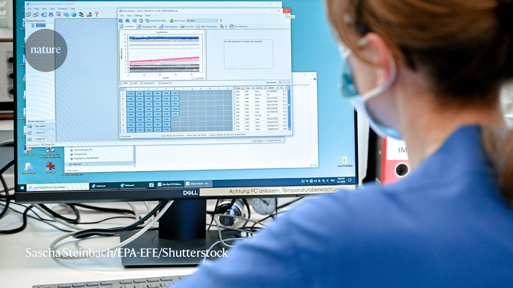
    
<small>Nature · 2021</small><strong>Spreadsheet errors silently corrupted published gene lists</strong>About 30% of examined papers contained gene-name errors.

  

  

    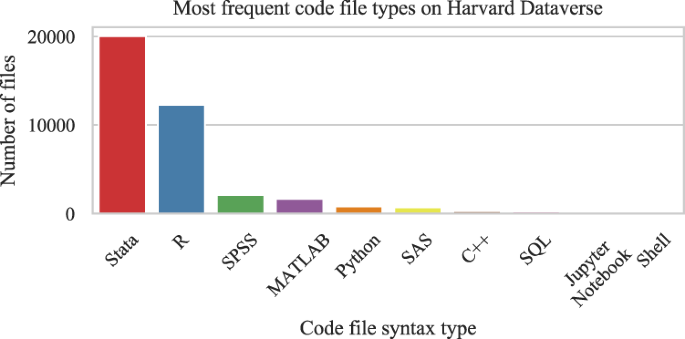
    
<small>Scientific Data · 2022</small><strong>Shared analysis code could not be rerun</strong>74% of tested R files failed in a clean environment.

  

  

    
    
<small>Nature News · 2011</small><strong>Invalid predictors reached patients in three cancer trials</strong>Research errors crossed into patient-facing studies.

  

  

    
    
<small>Nature · 2024</small><strong>Cyberattack cut researchers off from national collections</strong>Research access was disrupted for months.

  

  

    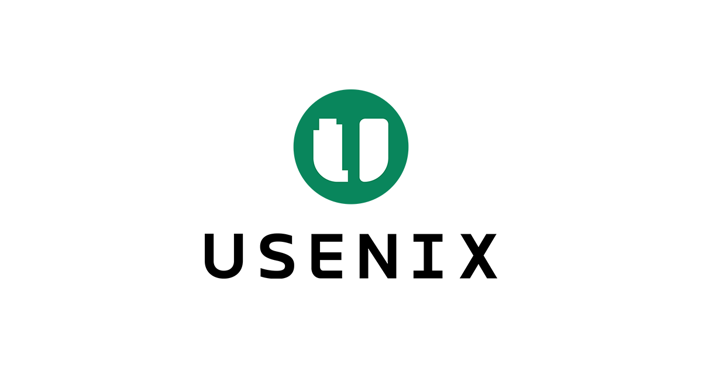
    
<small>USENIX · 2025</small><strong>AI-generated code pointed users to nonexistent packages</strong>Models invented 205,474 unique dependency names.

  

---

<!-- _class: risk hazard-focus -->

<b>◇</b>Hazard<b>!</b>Harm<b>◆</b>Control<b>✓</b>Evidence
 

## Why Research-Software Risk Recurs

<!--
Thread statement: Combine the scientific-assumption tension and recurring research conditions into one explanation of where software hazards come from.

- Researchers narrow a problem deliberately to isolate a phenomenon. This is sound scientific reasoning, not a mistake.
- The hazard emerges when software travels beyond the data, environment, user, scale, or purpose for which those assumptions were valid.
- Root conditions are not failures of commitment or intelligence. They describe the normal environment in which research software is created.
- Walk through the six visible conditions in the same order as the slide: evolving research, concentrated knowledge, limited capacity, temporary funding, prototype reuse, and AI acceleration.
- The connecting lines matter: these conditions often interact, so a local assumption or temporary shortcut can become a system-level hazard as the research evolves.
- Use the backup slide only when a different audience needs alternative conditions such as interdisciplinary communication, delivery pressure, changing dependencies, growing scale, or fragmented ownership.
- Transition: "Those hazards do not remain inside the software. The research program bears the consequences."
-->

Risk appears when software outlives its original assumptions.

  

    
<strong>Evolving research</strong>Data, methods, and questions change.

    
<strong>Concentrated knowledge</strong>Assumptions remain with one person.

    
<strong>Temporary funding</strong>Maintenance ends before use does.

  

  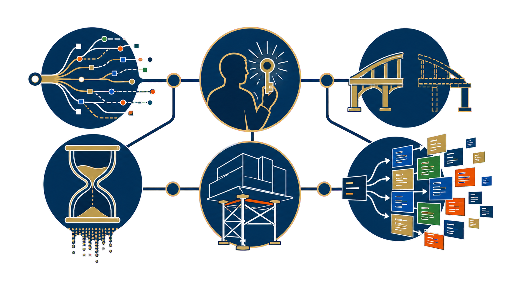

  

    
<strong>Limited capacity</strong>Testing and verification stay incomplete.

    
<strong>Prototype reuse</strong>One-time code becomes infrastructure.

    
<strong>AI acceleration</strong>Production outruns validation.

  

---

<!-- _class: risk harm-focus -->

<b>◇</b>Hazard<b>!</b>Harm<b>◆</b>Control<b>✓</b>Evidence

## When Software Hazards Materialize, Research Bears the Cost.

<!--
Thread statement: Establish that the consequences are real, then show how AI increases the rate and reach of the exposure.

- Keep the distinction clear: a hazard is the potential for failure; harm is the consequence to the research program.
- Follow the four visible consequences: validity, reproducibility, research time, and continuity.
- Validity: incorrect behavior can alter data, rankings, or conclusions.
- Reproducibility: environments, workflows, or undocumented assumptions can prevent verification and extension.
- Research time: diagnosis, repair, and rebuilding displace discovery.
- Continuity: essential tools and concentrated knowledge can disappear when funding, people, or systems change.
- AI is an amplifier rather than a separate category of harm: it increases the speed, volume, and apparent credibility of software that still requires validation.
- Connect these categories back to the documented cases on Slide 2 rather than introducing new examples here.
- Sources:
  - Eklund et al. (2016), fMRI clusterwise inference false-positive rates: https://doi.org/10.1073/pnas.1602413113
  - Trisovic et al. (2022), large-scale research-code execution study: https://doi.org/10.1038/s41597-022-01143-6
  - Institute of Medicine (2012), invalid omics tests used in three Duke cancer trials: https://www.ncbi.nlm.nih.gov/books/NBK202172/
  - Nature (2021), "Autocorrect errors in Excel still creating genomics headache": https://www.nature.com/articles/d41586-021-02211-4
  - Abeysooriya et al. (2021), "Gene name errors: Lessons not learned": https://doi.org/10.1371/journal.pcbi.1008984
  - British Library (2024), cyber-incident review: https://www.bl.uk/stories/blogs/posts/learning-lessons-from-the-cyber-attack
  - Spracklen et al. (2025), "Threats to scientific software from over-reliance on AI code assistants": https://www.nature.com/articles/s43588-025-00845-2
  - Spracklen et al. (2024), package hallucinations in code-generating LLMs: https://arxiv.org/abs/2406.10279
- Transition: "The answer is not to slow down research or avoid AI. It is to pair scientific expertise and accelerated implementation with professional engineering judgment."
-->

Software failures become research consequences.

  

    
<strong>Validity</strong>Incorrect software can change conclusions.

    
<strong>Reproducibility</strong>Results become difficult to verify or extend.

  

  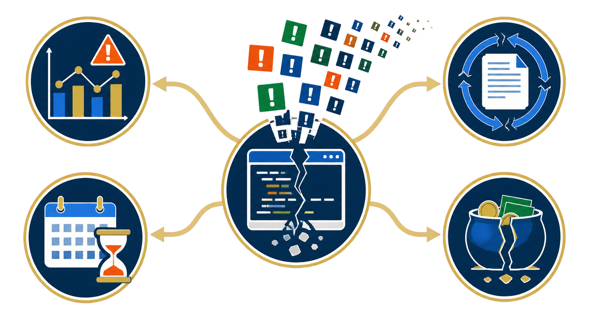

  

    
<strong>Research time</strong>Diagnosis and rebuilding displace discovery.

    
<strong>Continuity</strong>Essential tools and knowledge disappear.

  

---

<!-- _class: mitigate -->

<b>◇</b>Hazard<b>!</b>Harm<b>◆</b>Control<b>✓</b>Evidence

## CSSE Provides the Engineering Judgment Research Teams Need

<!--
Thread statement: CSSE's value is not a checklist of controls; it is practiced RSE judgment about which response is appropriate, sufficient, and sustainable.

- Follow the same four-part order as the previous slide: validity, reproducibility, research time, and continuity.
- Validity: judgment identifies which assumptions and outputs are consequential enough to require tests, traceability, or independent verification.
- Reproducibility: judgment determines what must be captured—and what evidence is sufficient—for others to verify and extend the work.
- Research time: judgment right-sizes architecture, automation, testing, and recovery to the consequence, maturity, users, and expected lifespan.
- Continuity: judgment anticipates the ownership, operational, documentation, and handoff model the research will actually need.
- Researchers bring deep scientific and domain judgment. They are not expected to build broad engineering pattern recognition while remaining focused on discovery.
- RSEs focus on exactly this work across projects and over time. That repeated exposure makes difficult-to-build engineering judgment available to the research team.
- AI is valuable implementation leverage. It does not own the research context, accept accountability, negotiate tradeoffs, or decide what evidence is sufficient.
- This slide should answer why CSSE is the partner. Later slides show the techniques and evidence as proof.
- Transition: "The example that follows shows this judgment in practice: identifying the consequential risks, applying proportionate controls, and making the evidence inspectable."
-->

Researchers bring scientific judgment. RSEs choose and right-size the engineering response.

  

    
<strong>Protect validity</strong>Identify which assumptions and results require evidence.

    
<strong>Enable reproducibility</strong>Decide what must be captured to verify and extend.

  

  

  

    
<strong>Preserve research time</strong>Right-size prevention, automation, and recovery.

    
<strong>Sustain continuity</strong>Design ownership and handoff for the expected lifespan.

  

---

<!-- _class: example -->

<b>◇</b>Hazard<b>!</b>Harm<b>◆</b>Control<b>✓</b>Evidence

## CSSE Identified the Risks That Matter for This Pilot

<!--
Thread statement: Make the first act of judgment visible: CSSE selected the three risks that could materially affect credible research use and the next investment decision.

- iNaturalist provides the motivating scale: more than 300 million observations and continued growth. INQUIRE is the concrete evaluation setting, with 250 expert information needs over the 5-million-image iNat24 collection.
- Keep those numbers distinct: 300 million describes the broader iNaturalist context; 5 million describes the benchmark collection used by INQUIRE.
- The goal is to enable INQUIRE-like natural-language search over iNaturalist data, including descriptions of behavior, habitat, or visual relationships that a species label alone may not capture.
- Many engineering concerns are possible. CSSE did not treat them as equally consequential or attempt to solve all of them.
- Consistency risk: rankings can shift as data and software change, shaping which examples a researcher sees and potentially influencing interpretation.
- Freshness risk: new observations must enter the index quickly and predictably or the search view falls behind the underlying collection.
- Growth risk: increasing data volume should not force the team to rebuild ingestion, indexing, search, or recovery workflows.
- Transition: "These three risks determine the controls shown in the demo; everything else is deliberately out of scope."
-->

Engagement challenge: apply INQUIRE’s expert-query approach to iNaturalist’s 300M+ observations.

  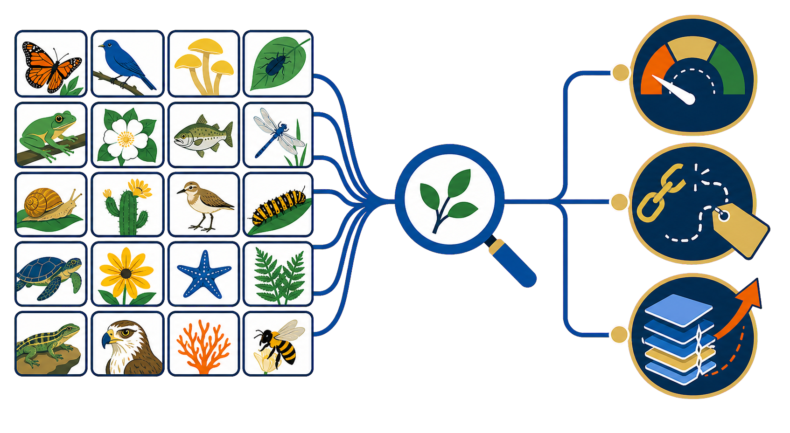

  

    
<strong>Does search remain consistent?</strong>Weak rankings can shape interpretation. New data can skew results.

    
<strong>Does search remain fresh?</strong>New observations should enter the index quickly and predictably.

    
<strong>Can it grow?</strong>Increasing volume should not require rebuilding.

  

---

<!-- _class: mitigate -->

<b>◇</b>Hazard<b>!</b>Harm<b>◆</b>Control<b>✓</b>Evidence

## CSSE Right-Sized Controls to the Selected Risks

<!--
Thread statement: Make the second act of judgment visible: CSSE chose the lightest controls that make the selected risks manageable and inspectable for a pilot.

- For consistency, run representative queries and show both the ranked images and retrieval metrics. Repeat the same query set after changes so quality shifts are visible rather than anecdotal.
- For freshness, append a new batch, update the index, and confirm that the new observations are searchable with their source metadata intact.
- For controlled growth, use repeatable batch ingestion, reruns, recovery paths, and measured throughput and latency so expansion does not require rebuilding the workflow.
- These controls are proportionate to a pilot. Production SLOs, full-scale resilience, and operational hardening are deliberately deferred until evidence justifies that investment.
- Call out the operational controls behind the interface: repeatable scripts, explicit recovery paths, and documented deployment comparisons reduce dependence on one developer or environment.
- If the live system is unavailable, use the recorded fallback and narrate the same checkpoints. The evidence should survive the demo format.
- Transition: "The controls are visible; the next question is what the current evidence actually proves."
-->

Enough control for a credible pilot without prematurely building a production service.

  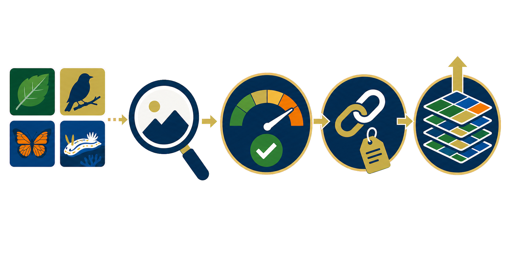

  

    
<strong>Keep search consistent</strong>Fixed queries, rankings, metrics, and thresholds.

    
<strong>Keep results fresh</strong>Append data, refresh the index, and preserve source context.

    
<strong>Grow without rebuilding</strong>Repeatable batches, measured behavior, and recovery paths.

  

---

<!-- _class: value -->

<b>◇</b>Hazard<b>!</b>Harm<b>◆</b>Control<b>✓</b>Evidence

## CSSE Defined What the Current Evidence Can Support

<!--
Thread statement: Make the third act of judgment visible: CSSE defines what evidence is sufficient for the next decision and prevents the team from overclaiming.

- Read the cards as evidence for the three concerns introduced on Slide 6: consistency, freshness, and growth.
- Consistency: precision at 10 asks how many of the first ten results are relevant; NDCG at 10 also rewards placing the most relevant results higher in the ranking. Together they establish a repeatable quality baseline.
- Freshness: the 24-to-48-vector append demonstrates that new data can enter the same search workflow and become queryable without rebuilding the index from scratch.
- Controlled growth: ingestion throughput, p95 search latency, repeatable recovery, and deployment comparisons make scaling behavior visible and revisitable.
- The checked-in benchmark reports 418 ms p95 search latency: data/evidence/benchmark-summary.json.
- Be explicit about the boundary of the claim: these are demo measurements from a limited test setup. They are evidence that the controls work, not production service-level objectives or proof of quantified risk reduction.
- The investment implication is conditional: this evidence can justify a pilot, while a production service would require larger-scale validation, agreed thresholds, monitoring, and operational ownership.
- The checked-in benchmark values are curated presentation evidence. The final raw benchmark export remains an evidence gap and should be captured before treating them as a new benchmark run.
- Production-readiness controls are a target operating model derived from the source architecture and demo assumptions; they are not evidence of a deployed production service.
- Transition: use the strength of the evidence—and the remaining uncertainty—to decide the next bounded increment.
-->

The evidence supports a pilot not production readiness or quantified risk reduction.

  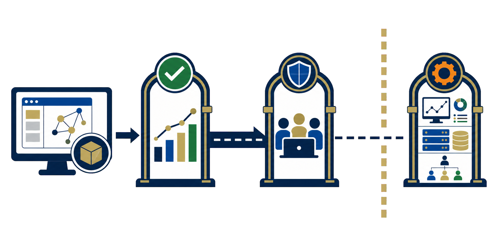

  

    
<strong>Quality changes are detectable</strong>0.72 P@10 / 0.81 NDCG@10 establish a repeatable baseline.

    
<strong>The refresh path works</strong>24 → 48 vectors; appended data became searchable.

    
<strong>Runtime remains measurable</strong>418 ms p95; behavior and recovery can be evaluated.

  

---

<!-- _class: team 

<b>◇</b>Hazard<b>!</b>Harm<b>◆</b>Control<b>✓</b>Evidence
-->

## The Team Behind the Controls

Leadership, engineering, and operations make the controls durable beyond a single project.

  

    <strong>Leadership</strong>
    

      

<strong>Rich Vuduc</strong>SSE Co-director

      

<strong>Jeffrey Young</strong>SSE Co-director

    

  

  

    <strong>Engineering + Operations</strong>
    

      

<strong>Dave Brownell</strong>Head of Engineering

      

<strong>Ketan Bhardwaj</strong>Senior RSE

      

<strong>Robert Bates</strong>Senior RSE

      

<strong>Nirvana Edwards</strong>Programs &amp; Ops

    

  

  Software engineeringArchitectureProduct + programUI/UXTechnical writing

<!--
Thread statement: Answer "Who is GT CSSE?" immediately after the example has demonstrated the team's judgment, controls, and evidence.

- Present the team as the professional capability behind the example, not as an unrelated roster.
- Team roster and source images: https://ssecenter.cc.gatech.edu/people/
- Transition: "This is the team that can bring the same risk-informed engineering judgment to the next research challenge."
-->

---

<!-- _class: cta -->

# Protect the Research Outcome Before Software Risk Compounds.

<!--
Thread statement: Close on the value created by risk-informed engineering, not on a predetermined service commitment.

- The deck uses a simplified Bowtie-inspired risk-and-assurance chain:
  Hazard -> Harm -> Control -> Evidence -> Outcome.
- This exact five-part sequence is not a standard named framework.
- Established Bowtie analysis connects hazards and threats to a loss-of-control event and consequences, with preventive and mitigating barriers.
- "Evidence" is added here as assurance that a barrier is implemented and effective; "Outcome" states why the process matters to research leadership.
- Sources:
  - UK Civil Aviation Authority, Bowtie method: https://www.caa.co.uk/safety-initiatives/working-with-industry/bowtie/about-bowtie/how-does-bowtie-work/
  - Office of Rail and Road, controls and assurance terminology: https://www.orr.gov.uk/guidance-compliance/rail/health-safety/occupational-health/good-practice/health-risk-management-assurance
-->

  
◇<h3>Surface the hazard</h3>
Where could assumptions or software fail?

  
!<h3>Name the harm</h3>
What would the research program lose?

  
◆<h3>Engage CSSE early</h3>
Choose a proportionate engineering control.

  
✓<h3>Prove the control works</h3>
Use evidence to demonstrate effectiveness.

  
→<h3>Protect the outcome</h3>
Trustworthy results · reproducible work · durable investment

**Start with one consequential workflow. CSSE will help define the risk, the right-sized control, and the evidence needed to proceed.**

---

<!-- _class: backup -->

# Backup

Supporting information for discussion

<!-- Thread statement: Use the backup material to answer questions without interrupting the main hazard-to-outcome narrative. -->

---

<!-- _class: risk -->

<b>◇</b>Hazard<b>!</b>Harm<b>◆</b>Control<b>✓</b>Evidence

## Alternative: The Public Record

<!--
- This alternative visual treatment stays in backup. Keep the main Slide 2 unchanged.
- Use two or three items suited to the audience rather than narrating all six.
- Each card uses authentic publisher artwork paired with the exact public headline or article title.
- Sources:
  - WIRED, "Bug in fMRI software calls 15 years of research into question": https://www.wired.com/story/fmri-bug-brain-scans-results/
  - Nature, "Autocorrect errors in Excel still creating genomics headache": https://www.nature.com/articles/d41586-021-02211-4
  - Scientific Data, "A large-scale study on research code quality and execution": https://www.nature.com/articles/s41597-022-01143-6
  - Nature News Blog, "Report reveals missteps in Duke cancer trial review": https://blogs.nature.com/blog/report_reveals_missteps_in_ini/
  - Nature, "Cyberattacks on knowledge institutions are increasing: what can be done?": https://www.nature.com/articles/d41586-024-00323-1
  - USENIX, "Package Hallucinations: How LLMs Can Invent Vulnerabilities": https://www.usenix.org/publications/loginonline/we-have-package-you-comprehensive-analysis-package-hallucinations-code
-->

Observed harms span validity, reproducibility, continuity, and AI-assisted development.

  

    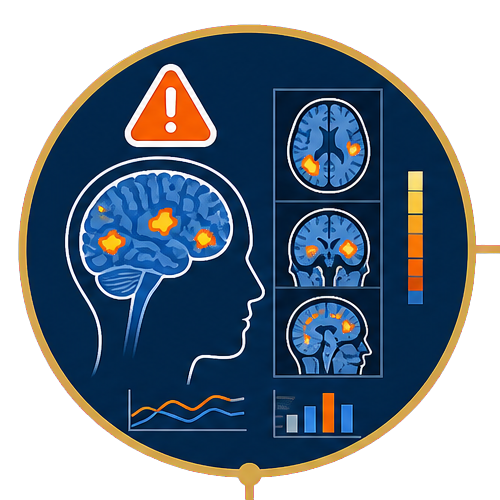
    
<strong>fMRI inference</strong>Common methods produced false-positive rates up to <strong>70%</strong>.<small>PNAS · 2016</small>

  

  

    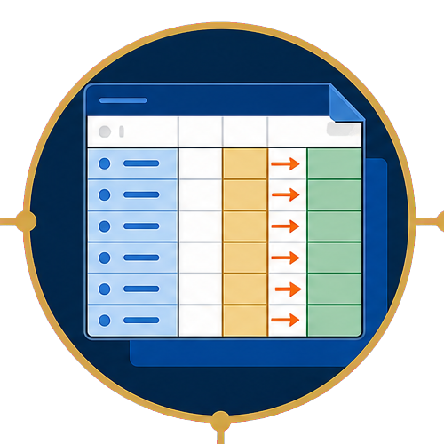
    
<strong>Genomic data</strong>Spreadsheet behavior silently converted gene names into dates.<small>PLOS · 2021</small>

  

  

    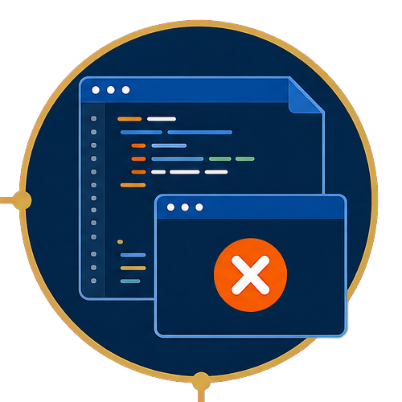
    
<strong>Shared code</strong><strong>74%</strong> of tested R files failed initial execution.<small>Scientific Data · 2022</small>

  

  

    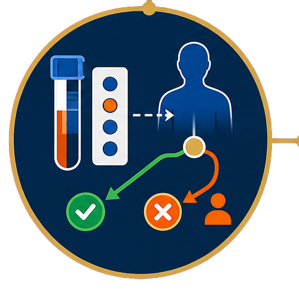
    
<strong>Clinical trials</strong>Invalid omics-based predictors were used in three cancer trials.<small>IOM · 2012</small>

  

  

    
    
<strong>Research access</strong>Ransomware removed access to most British Library online systems.<small>British Library · 2024</small>

  

  

    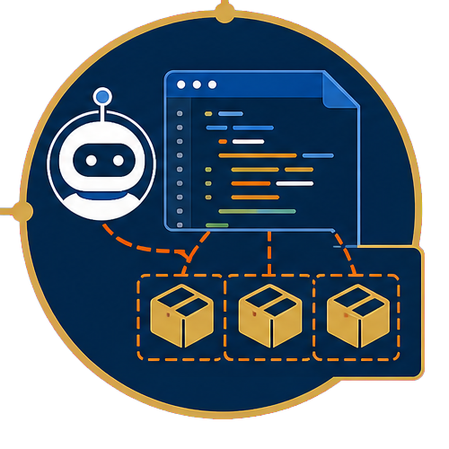
    
<strong>AI dependencies</strong>Code models generated <strong>205,474</strong> unique nonexistent package names.<small>Spracklen et al. · 2024</small>

  

---

<!-- _class: risk -->

<b>◇</b>Hazard<b>!</b>Harm<b>◆</b>Control<b>✓</b>Evidence

## Backup: Software Errors That Led to Retractions

<!--
- Use these cases to show that small research-software and data-processing errors can invalidate conclusions across disciplines.
- Distinguish programming defects from data-coding errors; "coding error" does not always mean a defect in source code.
- [Sources]
  - Retraction Watch, climate-analysis coding error: https://retractionwatch.com/2015/04/09/stats-error-has-chilling-effect-on-global-warming-paper/
  - Retraction Watch, pediatric long-COVID coding errors: https://retractionwatch.com/2024/08/20/coding-errors-prompt-retraction-of-paper-on-long-covid-in-kids/
  - Retraction Watch, fake-news software bug and erroneous data: https://retractionwatch.com/2019/01/09/oft-quoted-paper-on-spread-of-fake-news-turns-out-to-befake-news/
  - Retraction Watch, auditory-psychology script error: https://retractionwatch.com/2019/08/13/doing-the-right-thing-psychology-researchers-retract-paper-three-days-after-learning-of-coding-error/
  - Retraction Watch, EPA variable-coding error: https://retractionwatch.com/2013/01/04/paper-on-evidence-for-environmental-racism-in-epa-polluter-fines-retracted-for-coding-error/
  - Retraction Watch, one-line cancer-study programming error: https://retractionwatch.com/2016/09/26/coding-error-sinks-cancer-study/
-->

Small defects can erase conclusions across climate, health, psychology, and social science.

  
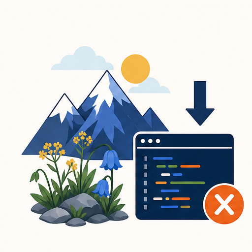
<small>Climate · analysis code</small><strong>Code created an apparent downward species shift</strong>The null-model error invalidated a major conclusion.

  
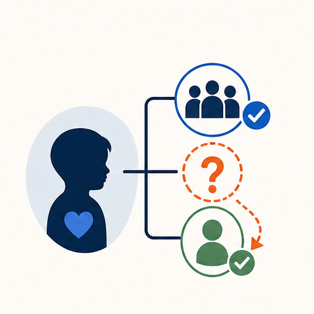
<small>Child health · data processing</small><strong>Long-COVID incidence was understated</strong>Correction changed the estimate from 0.4% to 1.4%.

  
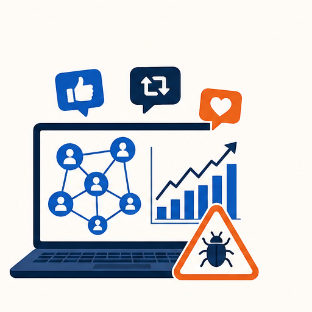
<small>Social media · software + data</small><strong>A fake-news conclusion became unsupported</strong>A software bug and erroneous inputs broke the model claim.

  

<small>Psychology · experiment script</small><strong>A script error invalidated experimental effects</strong>Prior-trial fluency was coded incorrectly.

  
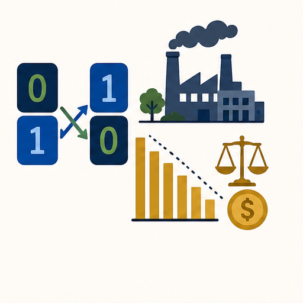
<small>Environmental justice · data coding</small><strong>Reversed values voided the EPA analysis</strong>Correcting the binary variable changed the findings.

  
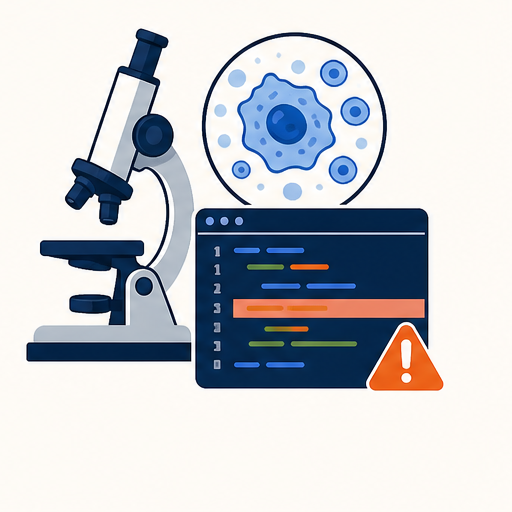
<small>Cancer research · program logic</small><strong>One faulty line caused a study retraction</strong>The defect changed calculated results.

---

<!-- _class: risk hazard-focus -->

<b>◇</b>Hazard<b>!</b>Harm<b>◆</b>Control<b>✓</b>Evidence

## Backup: Additional Condition-to-Hazard Mappings

<!--
- These six cards are alternatives for the six visible cards on Slide 3, not additional main-story content.
- Select only the mappings relevant to the director or research program.
- Interdisciplinary communication: requirements, provenance, and failure boundaries are interpreted differently across teams.
- Publication and delivery pressure: short-term results defer validation, documentation, and maintainability.
- Performance pressure: narrow optimization creates complex, platform-dependent implementations.
- Changing dependencies: environments drift and previously repeatable workflows stop working.
- Growing data and user scale: ingestion, performance, cost, and recovery behavior become brittle.
- Fragmented ownership: maintenance, security, incidents, and handoffs have no accountable owner.
-->

Six alternatives for tailoring the conversation to the research context.

  
<strong>Interdisciplinary communication</strong>Teams interpret requirements differently.

  
<strong>Delivery pressure</strong>Short-term results defer validation.

  
<strong>Performance pressure</strong>Narrow optimization increases complexity.

  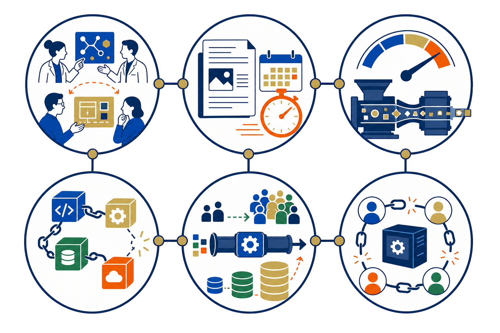

  
<strong>Changing dependencies</strong>Environment drift breaks workflows.

  
<strong>Growing scale</strong>Data and users stress brittle pipelines.

  
<strong>Fragmented ownership</strong>No one owns maintenance and handoff.

