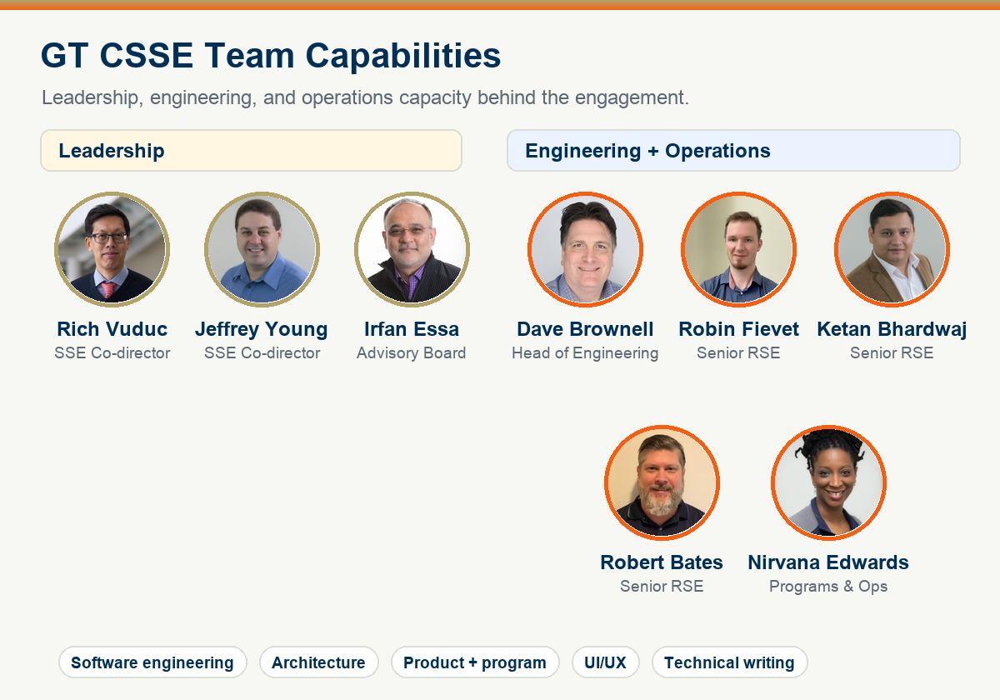

<!-- _class: title -->

# CSSE

## A Director's View

From research software risk to measurable, inspectable outcomes.

**Example engagement: iNaturalist x INQUIRE**

---

<!-- _class: risk -->

## Software Risks in Scientific Research

Research software risk is often invisible until a team tries to use it beyond the prototype.

| Risk | What It Looks Like | Director Impact |
| --- | --- | --- |
| Intangible outcomes | Demo code, notebooks, or one-off scripts that do not transfer into operation | Hard to fund, evaluate, or reuse |
| Unclear impact | Users cannot tell whether the software improves the research workflow | Adoption and stakeholder trust stall |
| Low quality | Fragile pipelines, missing provenance, weak tests, no scale path | Reproducibility and sustainability become unfunded liabilities |

---

<!-- _class: mitigate -->

## GT CSSE Mitigates Software Risks

CSSE turns research ambition into software evidence a sponsor can inspect.

| Tangible Outcomes | Real Impact | Production Quality |
| --- | --- | --- |
| Working systems, not just diagrams | Workflow evidence tied to scientific use | Source traceability, tests, metrics, and runbooks |
| Clear artifacts for PIs, RSEs, and directors | Usability, maintainability, and operational fit | Reproducibility, scalability, and reviewable architecture |
| Portfolio proof points across engagements | A basis for the next investment decision | A credible path from local proof to managed service |

> Project portfolio: [gt-csse.github.io/project-showcase](https://gt-csse.github.io/project-showcase/#/projects)

---

<!-- _class: example -->

## Example: iNaturalist x INQUIRE Engagement

**Risk:** support natural-language semantic search over fast-growing biodiversity imagery.

- iNaturalist has reached **300M observations** and continues to grow.
- INQUIRE frames the retrieval challenge around **250 expert ecological queries** over **5M iNat24 images**.
- Fresh data, provenance, retrieval quality, and scale all have to be visible.
- CSSE delivered a path that connects ingestion, embeddings, vector search, metrics, and review artifacts.

> Public context: iNaturalist milestone blog, March 20, 2026; INQUIRE benchmark site.

---

<!-- _class: demo -->

## Live Demo / Video

The demo makes the risk visible as an operating workflow, not a static claim.

- Start with a bounded collection and run a natural-language query.
- Append a new batch without rebuilding the system.
- Rerun the same query and inspect changed ranked results.
- Review scores, latency, source URLs, object keys, dimensions, and evidence artifacts.

> Fallback path: captured evidence shows the same before/after workflow if the live system is not available.

---

<!-- _class: value -->

## GT CSSE Delivered Value

| Dimension | Evidence From This Engagement | Why It Matters |
| --- | --- | --- |
| Outcome | FastAPI search, Ray ingestion, Qdrant vectors, SigLIP2/Infinity embeddings; source metadata preserved | Turns a research retrieval idea into a sponsor-visible workflow |
| Impact | **20,000** vectors; **37.8 images/sec** ingest; **418 ms** p95 search; **41%** cache-hit signal | Grounds the demo in scale and performance evidence |
| Quality | 50-query benchmark, Prometheus metrics, checkpoint resume, DLQ replay, quality gates | Makes retrieval behavior and operations reviewable |
| Resources and timeline |  |  |

> Evidence sources: Inquire-vector-search GitHub repo, `data/evidence/*.json`, `docs/technical-reference.md`.

---

<!-- _class: team -->

> Team roster and source images: [ssecenter.cc.gatech.edu/people](https://ssecenter.cc.gatech.edu/people/)

---

<!-- _class: cta -->

# Bring CSSE in when research outcomes depend on software quality.

| Speed | Scale | Reproduce | Use |
| --- | --- | --- | --- |
| Latency and throughput evidence | Fresh data and managed ingestion | Source trace, tests, and runbooks | Research workflow fit |

Choose the next dataset, quality gates, and operating target.
